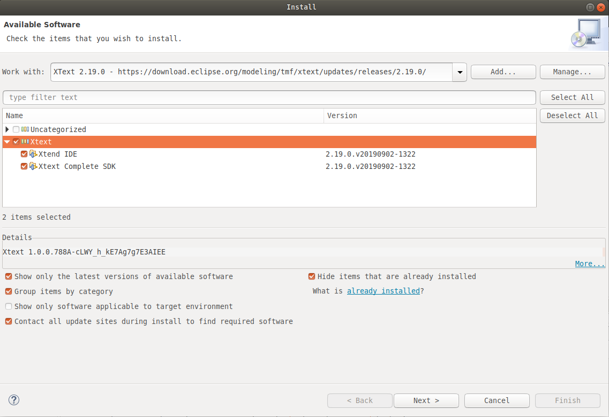
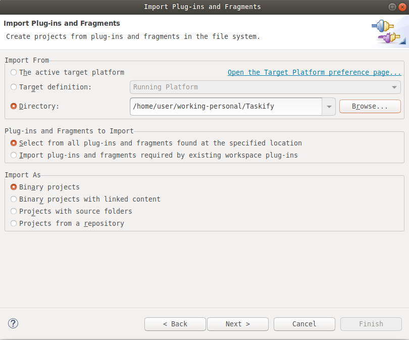
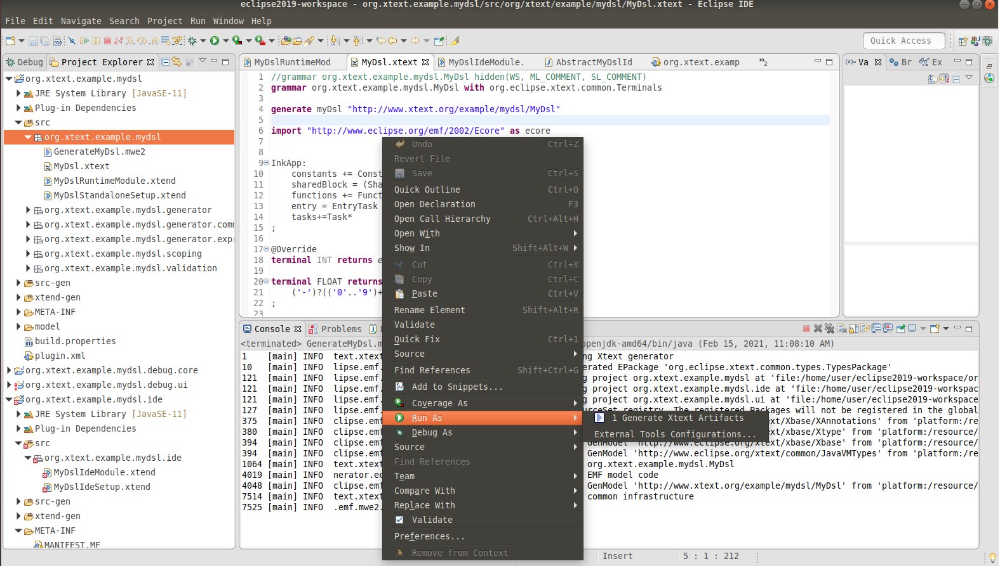
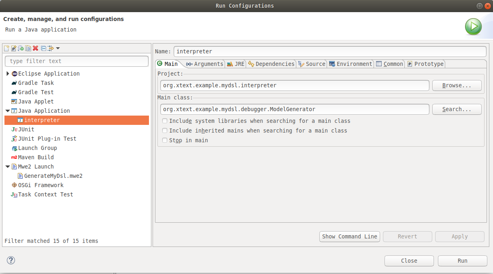
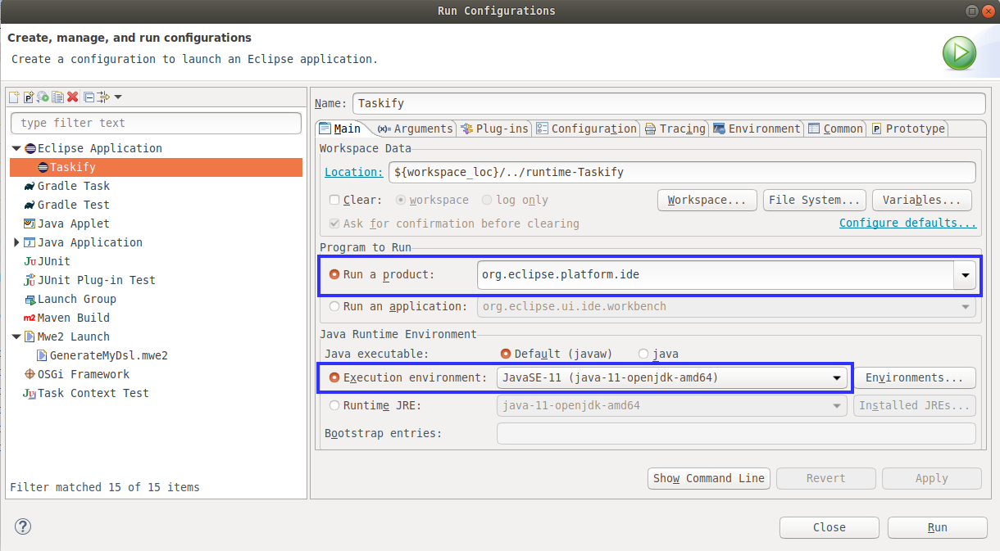
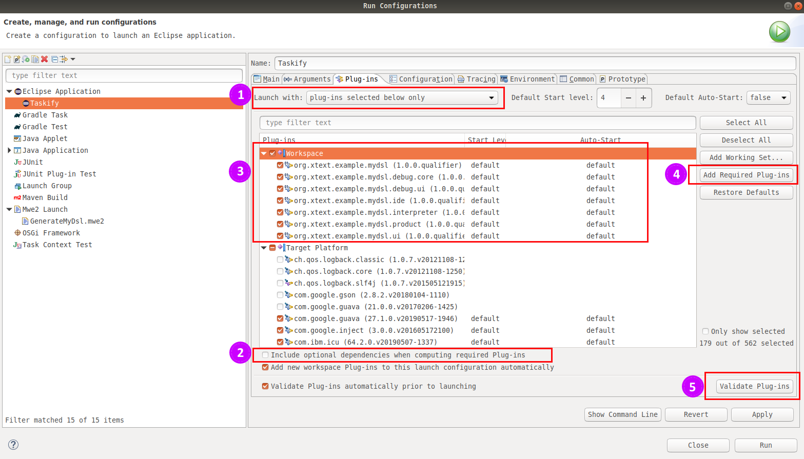
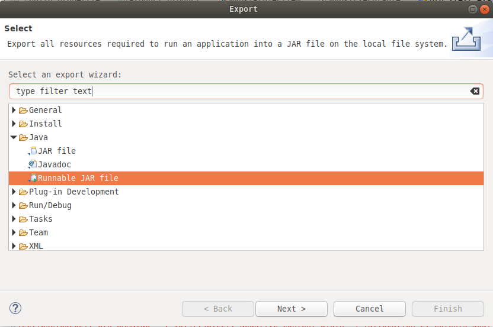
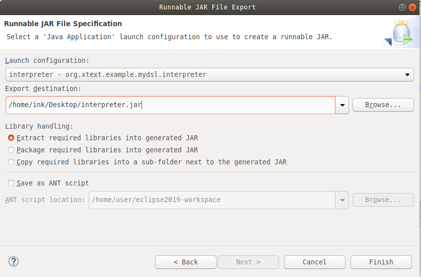

# Taskify

Taskify is an application development environment based on Eclipse. It is integrated into Eclipse Debug UI and Debug Core. Taskify enables engineers to develop and debug intermittent applications on a PC without target deployment.

-   Taskify enables the development of intermittent software using platform-independent TaskDSL domain-specific language.

-   Taskify has an interpreter integrated into TaskDSL.

-   Taskify supports debugging intermittent TaskDSL applications on PC.

-   Taskify automatically generates C code from a TaskDSL application for the InK runtime static library.

---

## Features of Taskify
#### 1. TaskDSL
TaskDSL is a domain-specific language defined with Xtext. Our TaskDSl editor supports the features below.

    Error detection
    Syntax coloring
    Proposals (Auto-completion)
    Scoping
    Cross reference
    Formatting
    Quick fix
    New project wizard including template proejcts
    Go to generated code

#### 2. Interpreter
Our TaskDSL interpreter enables engineers to run and debug TaskDSL applications on PC. The interpreter supports the features below.

    Call stack
    Symbol table
    Antlr based parser (provided by Xtext)
    Variables

#### 3. Development Environment integrated with Eclipse Debug UI
Taskify communicates with the interpreter through socket by request-response and event messages.

#### 4. C code generator
Taskify automatically generates C code linked to the InK runtime static library.

---

## Preparing System With Requirements
#### 1. JDK-11
Install OpenJDK to your Linux based system. Taskify has been developed Java-11. Therefore **it is highly recommended to set Java version to 11** since it has not been tested with other versions.

#### 2. Eclipse IDE
Taskify is an Eclipse plugin, so Eclipse must be installed to your system. Taskify was developed under **Eclipse IDE for C/C++ Developers - 2019-09 R (4.13.0)**. besides it was also tested with Java Developers edition. Experienced that newer versions cannot resolve dependencies completely.

-   Install Eclipse IDE 2019-09 R
https://www.eclipse.org/downloads/packages/release/2019-09/r/

#### 3. Xtext and Xtend Frameworks
Since TaskDSL is an implemented with Xtext framework with version of 2.19.0, Xtext must be installed into Eclipse. Experienced that newer versions have extra dependencies which cannot be resolved regularly.

-   Install Xtext 2.19.0 by adding below plugin repository. Need restart of Eclipse after installation !
https://download.eclipse.org/modeling/tmf/xtext/updates/releases/2.19.0/

---

## Building Up Environment
#### 1. Importing Taskify project
Taskify is developed as Eclipse plugin. Therefore it should be imported as *Plug-ins and Fragments* project under *Plug-in Development*. After selecting related menu item, in the next menu below configuration should be done.

> After importing Taskify project, Eclipse will build the project automatically. If not, force it manually from *Project* menu.

#### 2. Building TaskDSL
In order to generate Java files from xtend and xtext files, below configuration must be launched.

> If you have changes on expressions of the TaskDSL language, you have to re-run this configuration to activate changes.

After above steps are done, plug-ins dependencies must be resolved. However sometimes some of src folders are occurs in build path irregularly.
-   In the `debug.ui` project, xtend-gen source folder appear and needs to be deleted manually.
-   `mydsl.product` project has src folder in the build path, however there is no src folder inside the project. Deleting this configuration from build path will fix the problem.

---

## Debugging Interpreter
Sometimes it can be needed to debug interpreter after development on interpreter. In order to be able to debug interpreter, below launch configuration should be added.

---

## Launching Taskify IDE
Taskify IDE can be launched as new Eclipse instance. Run/debug launch configuration for Taskify is shown in the below image.

After creating launcher for Taskify, it has set of plugins to run properly. In order to resolve required plugins jump to *Plug-ins* tab and;
1.  Set *Launch with* property to *plug-ins selected below only*
2.  Check all projectsunder *Workspace*
3.  Uncheck *Include optional dependencies...* property
4.  Click *Add Required Plug-ins* to add required dependencies to launcher
5.  Click *Validate Plug-ins* to check if all dependencies are resolved. If not, go back to step#4.

After configuring required plug-ins, the menu should be like in the image below.

If there is any error occurs, please compare plugin versions with *Docs/all-plugins.txt*.

Taskify needs executable jar file which is generated from interpeter project. In order to generate executable jar file to represent interpreter, interpreter project must be exported as *Runnable jar*.

-   Right click on interpreter will show the menu including *Export* option.
-   After clicking *Export* menu item, there will be set of options to represent what to do. **Runnable JAR file** under *Java* must be selected, you can find it easily by typing too.

-   In the next menu;
    -    Launch configuration: Must be set to the one which had been previously created for purpose of debugging interpreter. (refer to <u>*Debugging Interpreter*</u> section)
    -    Export destination: The destination is hardcoded as `/home/ink/Desktop/interpreter.jar` in the `debug.core` project for the moment, so please make necessary directories and export it to given path. After exporting it to a temporary directory, you can copy/remove and rename the exported jar file too.

    
